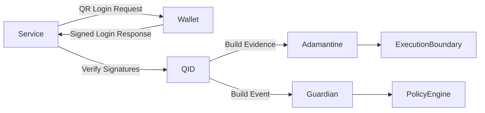

<!--
MIT License
Copyright (c) 2025 DarekDGB
-->
# 🔐 DigiByte Q-ID

## Quantum-Ready Authentication Protocol with Signed Payloads & Optional PQC Backends

### Stable Contract Baseline v1.0.0 · Hardening In Progress

------------------------------------------------------------------------

## 🟢 Release & Status


------------------------------------------------------------------------

> **DigiByte Q-ID is a standalone authentication protocol designed as a
> secure evolutionary successor to Digi-ID.** Deterministic.
> Fail-closed. Post-quantum ready.

------------------------------------------------------------------------

# 🧭 Architecture Overview



------------------------------------------------------------------------

# 1️⃣ What Q-ID Is

Q-ID is a **cryptographically signed authentication protocol**
providing:

- Deterministic payload signing
- Strict verification rules
- Replay protection (nonce-based)
- Optional Post-Quantum Cryptography (PQC)
- Hybrid (dual-algorithm) enforcement
- Fail-closed semantics

Q-ID is NOT:

- A wallet
- A custody solution
- A background service
- An automatic PQC switcher

Integration is explicit and controlled by wallets/services.

------------------------------------------------------------------------

# 2️⃣ Core Security Guarantees

Non-negotiable properties:

- **Fail-closed**
- **Deterministic canonical JSON**
- **No silent fallback**
- **Explicit PQC opt-in**
- **Hybrid = strict AND**
- **Test-locked contracts**
- **CI-enforced coverage (100%)**

------------------------------------------------------------------------

# 3️⃣ High-Level Flow

Service → QR Login Request → Wallet  
Wallet → Signed Login Response → Service  
Service → Verify → Accept / Reject

------------------------------------------------------------------------

# 4️⃣ Repository Structure

    qid/
    ├─ canonical.py
    ├─ crypto.py
    ├─ protocol.py
    ├─ binding.py
    ├─ pqc_backends.py
    ├─ pqc_sign.py
    ├─ pqc_verify.py
    ├─ hybrid_key_container.py
    ├─ integration/
    │  ├─ adamantine.py
    │  └─ guardian.py
    └─ uri_scheme.py

------------------------------------------------------------------------

# 5️⃣ Cryptographic Algorithms

| Identifier | Purpose | Mode |
|---|---|---|
| `dev-hmac-sha256` | CI / development | Stub |
| `pqc-ml-dsa` | ML-DSA | Stub → liboqs |
| `pqc-falcon` | Falcon | Stub → liboqs |
| `pqc-hybrid-ml-dsa-falcon` | Hybrid | Strict AND |

Legacy alias: `hybrid-dev-ml-dsa` (compatibility only)

------------------------------------------------------------------------

# 6️⃣ Stub Mode vs Real PQC Mode

### Default (CI-Safe)

- No external crypto dependencies
- Deterministic testable signatures
- Default CI path
- Real backend not assumed

### Real PQC Mode

```bash
export QID_PQC_BACKEND=liboqs
export QID_PQC_TESTS=1
```

Explicit opt-in only.

------------------------------------------------------------------------

# 7️⃣ Hybrid Signatures

Hybrid verification requires:

- ML-DSA valid
- Falcon valid

If either fails → authentication fails.

No downgrade. No OR logic.

------------------------------------------------------------------------

# 8️⃣ Adamantine Integration (Stable)

Module:

    qid.integration.adamantine

Provides:

- Evidence builder
- Evidence verifier

------------------------------------------------------------------------

# 9️⃣ Guardian Integration (Stable)

Module:

    qid.integration.guardian

Provides:

- Event builder
- Structural validator

------------------------------------------------------------------------

# 🔟 Test Suite & CI

- 100% coverage enforced in default CI
- CI-safe default execution path
- Optional real-PQC workflow
- No silent fallback
- Canonical JSON serialization locked by tests

------------------------------------------------------------------------

# 11️⃣ Versioning Truth

Current package metadata remains:

- **Package version:** `1.0.0`
- **Stable contract baseline:** `v1.0.0`

------------------------------------------------------------------------

# 12️⃣ Stability Guarantees

- Stable API surface
- Stable protocol behavior
- Stable integration adapters
- Breaking changes require major version bump

------------------------------------------------------------------------

# 13️⃣ Summary

✔ Signed authentication  
✔ Optional PQC backend  
✔ Hybrid strict enforcement  
✔ Fail-closed verification  
✔ Canonical JSON hardening  
✔ Adamantine adapter  
✔ Guardian adapter  
✔ Stable contract baseline

------------------------------------------------------------------------

**MIT License — © 2025 DarekDGB**  
*Q-ID does not guess. It verifies.*
