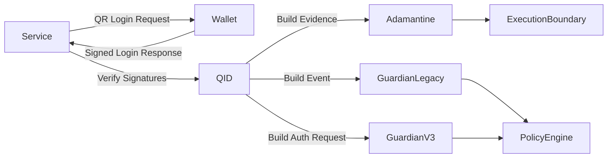

<!--
MIT License
Copyright (c) 2025 DarekDGB
-->
# 🔐 DigiByte Q-ID

## Quantum-Ready Authentication Protocol with Signed Payloads & Optional PQC Backends

### Stable Minor Release v1.1.0 · Guardian Wallet v3 Bridge Added

------------------------------------------------------------------------

## 🟢 Release & Status

------------------------------------------------------------------------

> **DigiByte Q-ID is a standalone authentication protocol designed as a secure evolutionary successor to Digi-ID.** Deterministic. Fail-closed. Post-quantum ready.

------------------------------------------------------------------------

# 🧭 Architecture Overview

------------------------------------------------------------------------

# 1️⃣ What Q-ID Is

Q-ID is a **cryptographically signed authentication protocol** providing:

- deterministic payload signing
- strict verification rules
- replay protection (nonce-based)
- optional Post-Quantum Cryptography (PQC)
- hybrid (dual-algorithm) enforcement
- fail-closed semantics

------------------------------------------------------------------------

# 2️⃣ Core Security Guarantees

- **Fail-closed**
- **Deterministic canonical JSON**
- **No silent fallback**
- **Explicit PQC opt-in**
- **Hybrid = strict AND**
- **Test-locked contracts**
- **CI-enforced coverage (100%)**

------------------------------------------------------------------------

# 3️⃣ Integration Surface

Q-ID currently supports:

- signed login response generation
- strict verification and binding checks
- Adamantine evidence building
- legacy Guardian event building
- **Guardian Wallet v3 auth request building**

New in `v1.1.0`:
- `contracts/guardian_qid_auth_request_v1.json`
- `qid/integration/guardian_v3.py`
- strict schema validation for Guardian Wallet v3 auth requests
- deterministic request ID derivation for auth bridge requests

------------------------------------------------------------------------

# 4️⃣ Guardian Wallet v3 Auth Bridge

Q-ID now supports a dedicated **Guardian Wallet v3 auth bridge**.

Design rule:
- Q-ID auth is **not** encoded as transaction context

Instead, Q-ID builds a request with:
- `mode = "qid_auth"`
- empty `wallet_ctx`
- empty `tx_ctx`
- populated `auth_ctx`
- optional `extra_signals`

See:
- `docs/qid-guardian-v3-auth-integration.md`
- `contracts/guardian_qid_auth_request_v1.json`

------------------------------------------------------------------------

# 5️⃣ Example

Example roundtrip file:
- `examples/guardian_v3_auth_roundtrip.py`

This example demonstrates:
- building a Q-ID login URI
- preparing a signed login response
- building a Guardian Wallet v3 auth request
- validating the request shape fail-closed

------------------------------------------------------------------------

# 6️⃣ Test Suite & CI

- 100% coverage enforced
- canonical JSON locked by tests
- fail-closed behavior guaranteed
- Guardian Wallet v3 auth bridge covered by regression tests

------------------------------------------------------------------------

# 7️⃣ Versioning Truth

- **Current version:** `v1.1.0`
- first minor release after `v1.0.2`
- additive integration release
- no breaking protocol change

------------------------------------------------------------------------

**MIT License — © 2025 DarekDGB**  
*Q-ID does not guess. It verifies.*
