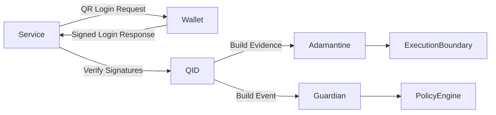

<!--
MIT License
Copyright (c) 2025 DarekDGB
-->
# 🔐 DigiByte Q-ID

## Quantum-Ready Authentication Protocol with Signed Payloads & Optional PQC Backends

### Stable Contract Baseline v1.0.1 · Hardening In Progress

------------------------------------------------------------------------

## 🟢 Release & Status

------------------------------------------------------------------------

> **DigiByte Q-ID is a standalone authentication protocol designed as a
> secure evolutionary successor to Digi-ID.** Deterministic.
> Fail-closed. Post-quantum ready.

------------------------------------------------------------------------

# 🧭 Architecture Overview

------------------------------------------------------------------------

# 1️⃣ What Q-ID Is

Q-ID is a **cryptographically signed authentication protocol**
providing:

- Deterministic payload signing
- Strict verification rules
- Replay protection (nonce-based)
- Optional Post-Quantum Cryptography (PQC)
- Hybrid (dual-algorithm) enforcement
- Fail-closed semantics

------------------------------------------------------------------------

# 2️⃣ Core Security Guarantees

- **Fail-closed**
- **Deterministic canonical JSON**
- **No silent fallback**
- **Explicit PQC opt-in**
- **Hybrid = strict AND**
- **Test-locked contracts**
- **CI-enforced coverage (100%)**

------------------------------------------------------------------------

# 🔟 Test Suite & CI

- 100% coverage enforced
- Canonical JSON locked by tests
- Fail-closed behavior guaranteed

------------------------------------------------------------------------

# 11️⃣ Versioning Truth

- **Current version:** `v1.0.1`
- **Coverage lock release:** `v1.0.1`
- Hardening continues without breaking contracts

------------------------------------------------------------------------

**MIT License — © 2025 DarekDGB**  
*Q-ID does not guess. It verifies.*
