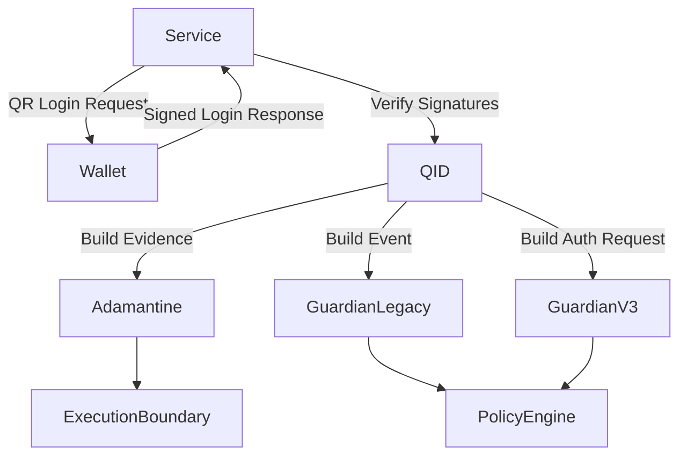

<!--
MIT License
Copyright (c) 2025 DarekDGB
-->
# DigiByte Q-ID

## Quantum-Ready Authentication Protocol with Signed Payloads & Optional PQC Backends

### Q-ID v1.1.0 package baseline - Guardian Wallet v3 Auth Bridge

------------------------------------------------------------------------

## Release & Status


[](https://github.com/DarekDGB/DigiByte-Q-ID/actions/workflows/tests.yml)

The published `v1.1.0` tag and current working tree are different snapshots.
V4.10-G1 aligns the later compatibility documentation and retains package
`1.1.0` deliberately for this documentation/test-only step. It creates no
release tag. See [current release truth](docs/RELEASES/V4_10_G1_RELEASE_TRUTH.md)
for the source commit, tag, test results, and remaining post-commit gates.

------------------------------------------------------------------------

> **DigiByte Q-ID is a standalone authentication protocol with explicit backend selection.** Its default deterministic stub is for development and tests; it is not secure PQC. Real Q-ID PQC requires explicit `QID_PQC_BACKEND=liboqs` selection and an available backend.

------------------------------------------------------------------------

# Architecture Overview


```mermaid
flowchart TD
    Service -->|QR Login Request| Wallet
    Wallet -->|Signed Login Response| Service
    Service -->|Verify Signatures| QID
    QID -->|Build Evidence| Adamantine
    QID -->|Build Event| GuardianLegacy
    QID -->|Build Auth Request| GuardianV3
    Adamantine --> ExecutionBoundary
    GuardianLegacy --> PolicyEngine
    GuardianV3 --> PolicyEngine
```

------------------------------------------------------------------------

# 1. What Q-ID Is

Q-ID is a **cryptographically signed authentication protocol** providing:

- deterministic payload signing
- strict verification rules
- nonce and binding validation for replay-aware authentication flows
- optional Post-Quantum Cryptography (PQC)
- hybrid (dual-algorithm) enforcement
- fail-closed semantics

Services remain responsible for nonce issuance and replay state, key handling,
and deployment policy. Q-ID is not a custody or transaction execution service.

------------------------------------------------------------------------

# 2. Core Security Guarantees

- **Fail-closed**
- **Deterministic canonical JSON**
- **No silent fallback**
- **Explicit PQC opt-in**
- **Hybrid = strict AND**
- **Test-locked contracts**
- **CI-enforced coverage (100%)**

These are tested implementation contracts, not a production certification.
The named `qid-canonical-json-v1` profile handles internal Q-ID bytes;
`adamantine-qid-canonical-json-v1` handles the AdamantineOS proof-hash boundary.

------------------------------------------------------------------------

# 3. Integration Surface

Q-ID currently supports:

- signed login response generation
- strict verification and binding checks
- Adamantine evidence building
- legacy Guardian event building
- **Guardian Wallet v3 auth request building**

New in `v1.1.0`:
- `contracts/guardian_qid_auth_request_v1.json`
- `qid/integration/guardian_v3.py`
- strict schema validation for Guardian Wallet v3 auth requests
- deterministic request ID derivation for auth bridge requests

The [frozen Shield compatibility contract](docs/CONTRACTS/QID_SHIELD_V4_CRYPTO_ALIGNMENT.md)
is documentation and integrity metadata only. Q-ID does not verify Shield
cryptography or grant execution authority. Identity keys, Shield decision keys,
trust registries, domain tags, canonicalization profiles, and verifier policies
remain separate. AdamantineOS remains the final fail-closed policy and execution
boundary. The Guardian v3 auth bridge is not a Shield receipt verifier.

------------------------------------------------------------------------

# 4. Guardian Wallet v3 Auth Bridge

Q-ID now supports a dedicated **Guardian Wallet v3 auth bridge**.

Design rule:
- Q-ID auth is **not** encoded as transaction context

Instead, Q-ID builds a request with:
- `mode = "qid_auth"`
- empty `wallet_ctx`
- empty `tx_ctx`
- populated `auth_ctx`
- optional `extra_signals`

See:
- `docs/qid-guardian-v3-auth-integration.md`
- `contracts/guardian_qid_auth_request_v1.json`

------------------------------------------------------------------------

# 5. Example

Example roundtrip file:
- `examples/guardian_v3_auth_roundtrip.py`

This example demonstrates:
- building a Q-ID login URI
- preparing a signed login response
- building a Guardian Wallet v3 auth request
- validating the request shape fail-closed

------------------------------------------------------------------------

# 6. Test Suite & CI

- 100% statement and branch coverage enforced by the unchanged configuration
- canonical JSON locked by tests
- fail-closed behavior exercised by positive and negative tests
- Guardian Wallet v3 auth bridge covered by regression tests

V4.10-G1 candidate local run on CPython 3.11.15: **625 passed, 12 expected
optional-OQS skips; 1662/1662 statements and 702/702 branches covered**.
The 12 skipped tests require optional native OQS and are not counted as passed.

```bash
python -m pip install -e ".[dev]"
python -m pytest
```

Standard `tests` CI proves the deterministic repository gate. The separate
`PQC Optional (liboqs real backend)` workflow uses explicit opt-in, but has no
exact node-ID and zero-skip guard. A green optional run alone does not prove
that every intended native test executed and does not prove Shield live OQS.
G1 changes neither workflow and makes no new guarded live-OQS claim.

------------------------------------------------------------------------

# 7. Versioning Truth

- **Package metadata:** `1.1.0`, retained without a bump in G1.
- **Published tag:** `v1.1.0`, a historical snapshot predating the G1 source.
- **Working tree:** later compatibility and documentation work; no new release
  is declared by this step and the next independent release number is unassigned.
- The v1.1.0 Guardian v3 bridge was additive, with no breaking protocol change.
- Q-ID does not inherit the Shield `v4.0.0` release number.

See [v1.1.0 release history](docs/qid-v1.1.0-release-plan.md) and
[G1 release truth](docs/RELEASES/V4_10_G1_RELEASE_TRUTH.md).

------------------------------------------------------------------------

**MIT License - Copyright (c) 2025 DarekDGB**
*Q-ID does not guess. It verifies.*
